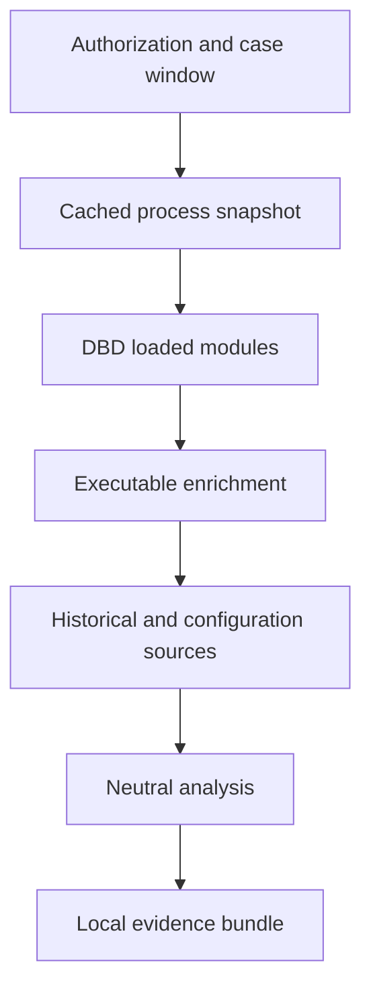

# v0.2 architecture

## Layers

1. **WPF suite shell** — case input, module selection, authorization, activity and local output handling.
2. **Collection orchestrator** — ordered, cancellable and failure-isolated execution of `IEvidenceCollector` modules.
3. **Windows source adapters** — live state, execution history, persistence, scheduled tasks and devices.
4. **Normalized evidence model** — source provenance plus separate collection/source timestamps.
5. **Neutral analyzer** — deterministic `needsReview` and `coverageGap` summaries; no verdict API.
6. **Packaging/reporting** — JSON, offline HTML, diagnostics, privacy reminder and SHA-256 manifest.

## Volatile-first sequence

The cached process provider ensures that process facts are not recollected after hashing has introduced delay. Historical adapters cannot mutate the sources they read.

## Extension contract

New top-level modules implement `IEvidenceCollector`. Execution-history sub-sources implement `IExecutionHistorySource` and return an `EvidenceSourceResult` with explicit status, records and detail. A new adapter must:

- be read-only and cancellable;
- state its timestamp semantics;
- return explicit source coverage;
- redact paths before creating records;
- avoid credentials, account identifiers and arbitrary content;
- add schema/privacy documentation; and
- add success, failure and redaction tests.

## Future backend boundary

The v0.2 client has no upload path. A future staff analyzer should consume the same bundle schema without granting it collection privileges. Any case backend must use short-lived case authorization, authenticated encryption, retention enforcement, audit logs and independently signed rule metadata.
