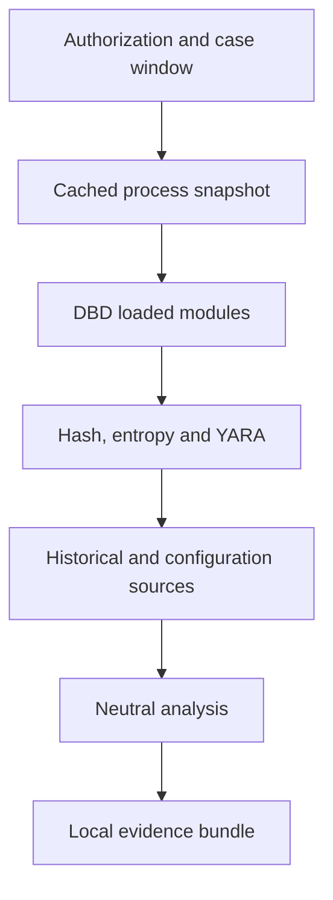

# v0.5 architecture

## Layers

1. **WPF suite shell** — case input, module selection, searchable module catalog, scoped evidence explorer, authorization, activity and local output handling.
2. **Collection orchestrator** — ordered, cancellable and failure-isolated execution of `IEvidenceCollector` modules.
3. **Windows source adapters** — live state, execution history, persistence, scheduled tasks and devices.
4. **Bounded binary triage** — the existing referenced-file read calculates SHA-256 and Shannon entropy; optional libyara scans use embedded and operator-selected rules without copying files.
5. **Normalized evidence model and search** — source provenance plus separate collection/source timestamps and case-insensitive full-field filtering.
6. **Neutral analyzer** — deterministic `needsReview` and `coverageGap` summaries; no verdict API.
7. **Packaging/reporting** — JSON, offline HTML, diagnostics, privacy reminder and SHA-256 manifest.

## Volatile-first sequence

The cached process provider ensures that process facts are not recollected after hashing has introduced delay. Historical adapters cannot mutate the sources they read.

## Portable packaging

The release target is a self-contained `win-x64` single-file executable. It does not install a service or driver, write an uninstaller entry or persist settings. The .NET single-file host may extract native libyara components to the runtime extraction area while the app is running. The embedded baseline rule file is materialized in a unique temporary directory, hashed, compiled and removed when the collection finishes. An operator-selected custom rule file remains in place and its contents are not exported.

The executable manifest requires administrator elevation before the WPF application starts. Elevation improves access to approved read-only sources but does not bypass the in-app authorization gate or change module scope. Cancelling UAC prevents the process from starting.

## Search contract

The module catalog searches names, categories, capabilities, boundaries and evidence-kind aliases. The evidence explorer searches normalized record metadata and field keys/values, with a second scope filter for one module, source or record kind. It does not reopen the raw Windows sources and therefore cannot silently broaden collection. The extended forensic metadata group is off by default and contributes only normalized Amcache executable inventory, Application Error crash metadata and PowerShell engine/provider lifecycle metadata.

## Extension contract

New top-level modules implement `IEvidenceCollector`. Execution-history sub-sources implement `IExecutionHistorySource` and return an `EvidenceSourceResult` with explicit status, records and detail. A new adapter must:

- be read-only and cancellable;
- state its timestamp semantics;
- return explicit source coverage;
- redact paths before creating records;
- avoid credentials, account identifiers and arbitrary content;
- add schema/privacy documentation; and
- add success, failure and redaction tests.

## Future backend boundary

The v0.5 client has no upload path. A future staff analyzer should consume the same bundle schema without granting it collection privileges. Any case backend must use short-lived case authorization, authenticated encryption, retention enforcement, audit logs and independently signed rule metadata.
